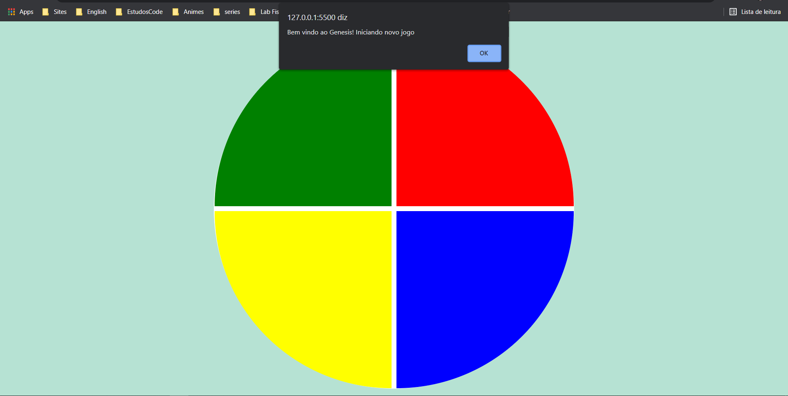
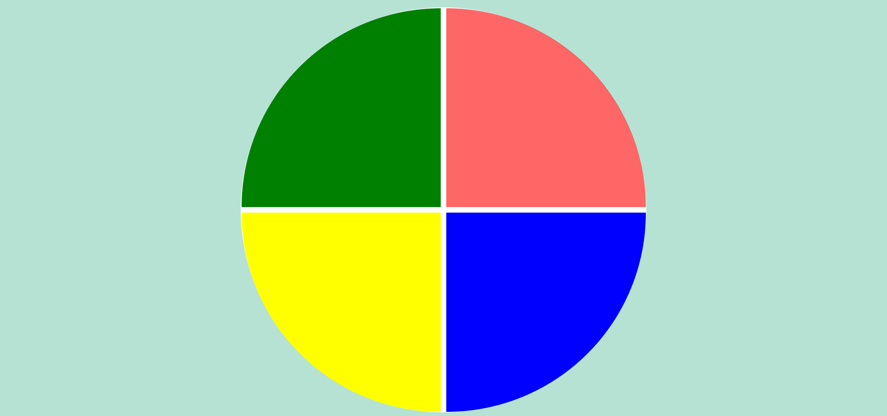
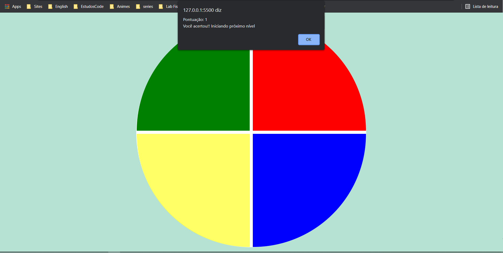
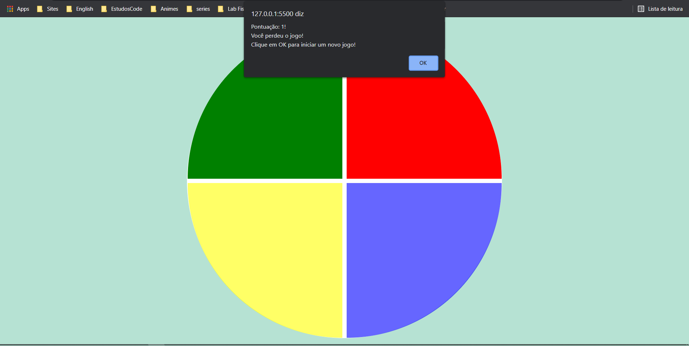

<h1 align="center"> 🤓 Genesis-Game 🤓</h1>

 
Nesse projeto, o desafio foi criar um jogo Gênesis utilizando apenas HTML, CSS e Javascript de forma introdutória, 
sendo o principal conceito, CSS Grid, manipulação de Array e Arrow Functions.

<h3> 📌 Página inicial </h3>

<h3> 📌 Página jogando </h3>

<h3> 📌 Página Score </h3>

<h3> 📌 Página Game Over </h3>

<h3>⚙️ Melhorias</3>

- [ ] Adicionar paginas de inicio e game over.

